<div align="center">

# Cachex Arena

**Play our COMP30024 minimax agent, watch AI vs AI, step through our A\* search, and see how strong the agent really is, with confidence intervals.**

[](https://github.com/rNLKJA/Cachex-AI/actions/workflows/ci.yml)
[](https://nextjs.org/)
[](https://www.typescriptlang.org/)
[](https://handbook.unimelb.edu.au/2022/subjects/comp30024)
[](LICENSE)

**Live demo: [cachex-ai.vercel.app](https://cachex-ai.vercel.app)**

</div>

---

## Showcase

<p align="center">
  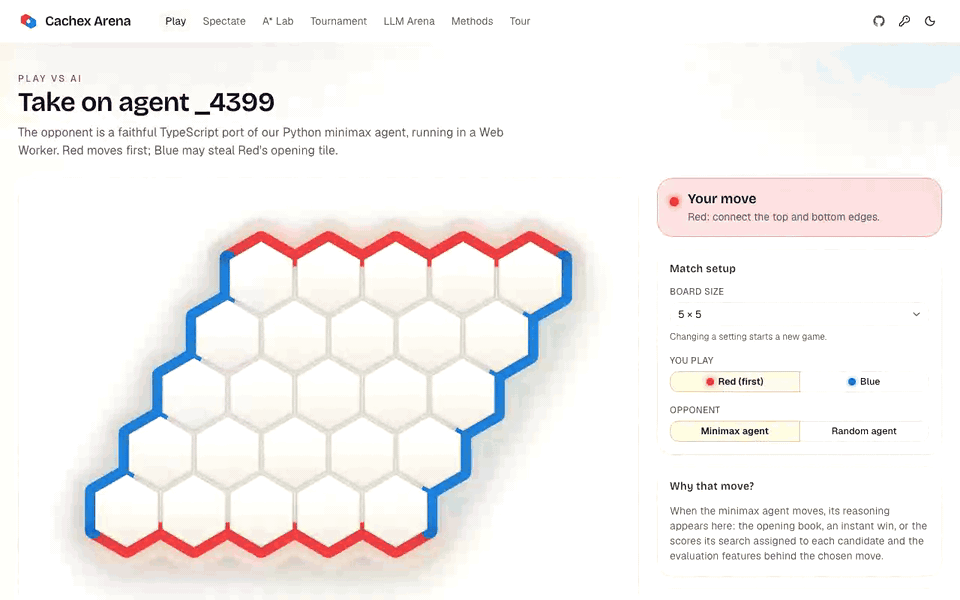
</p>

**[Take the guided tour →](https://cachex-ai.vercel.app/tour)** Three captioned walkthrough videos and
every screenshot below, recorded from a production build of the site by a reproducible Playwright script
([`web/e2e/showcase.spec.ts`](web/e2e/showcase.spec.ts), run with `pnpm showcase`) that also checks
each step, so the same seeds give the same moves and numbers. No real API key appears anywhere:
the AI steps use a placeholder key and a mocked reply, labelled on screen.

### Key features

| | |
| --- | --- |
| 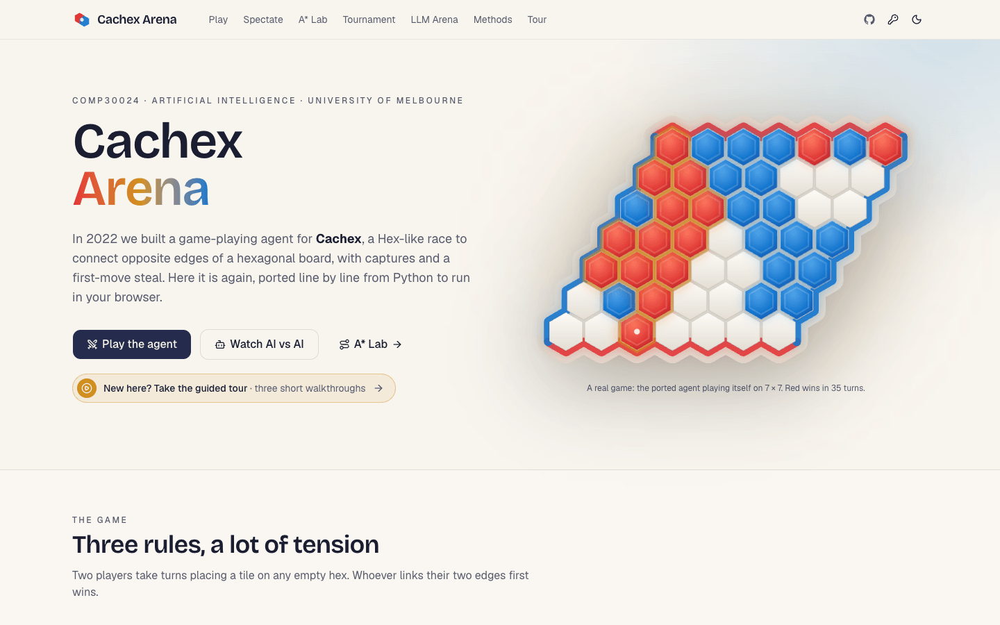<br>**Landing page.** The game, the coursework and the key results, each with its interval. | 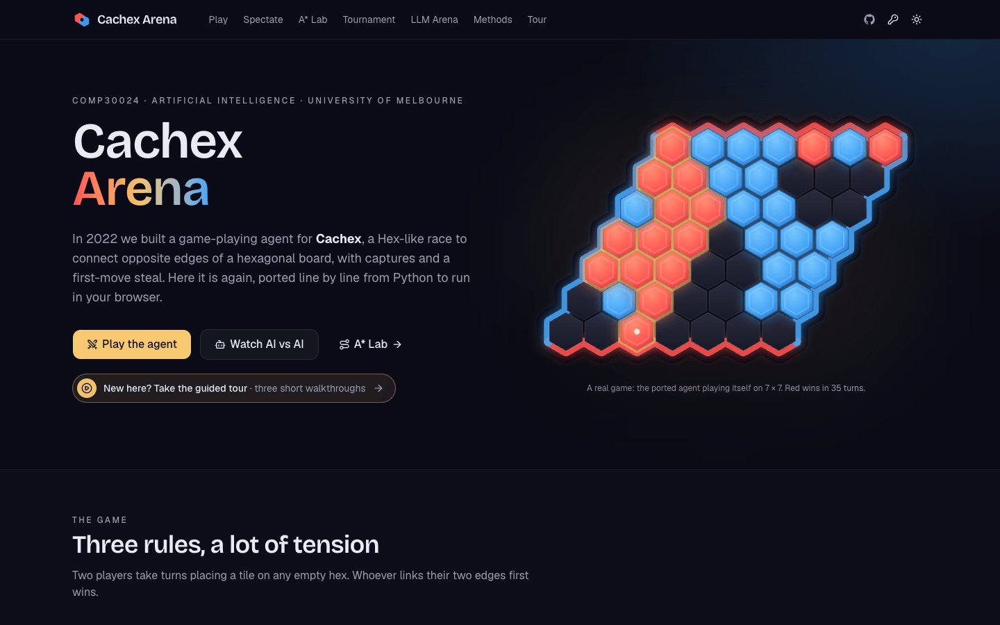<br>**Dark mode.** The same page in dark mode. |
| 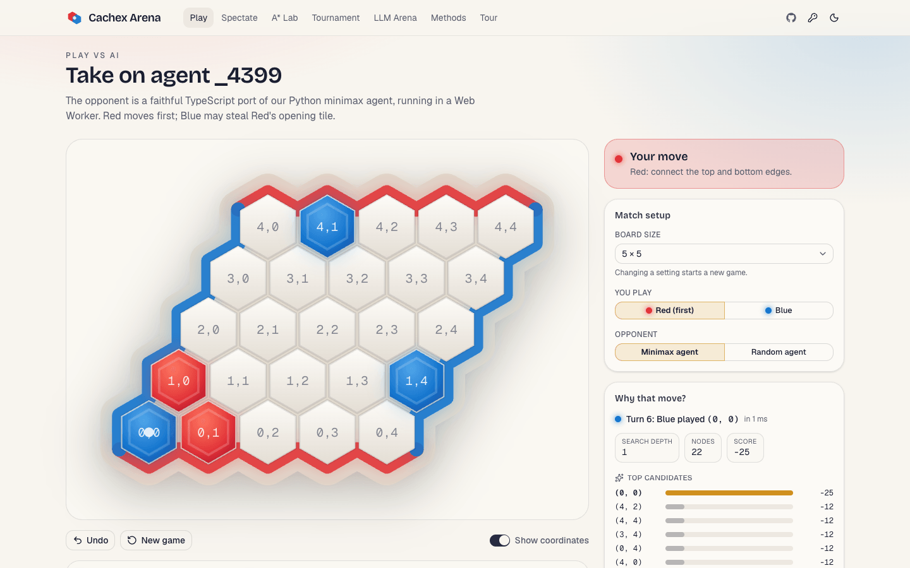<br>**Play the agent.** After a capture and a recapture on 5 × 5, with the agent's search for its capture. | 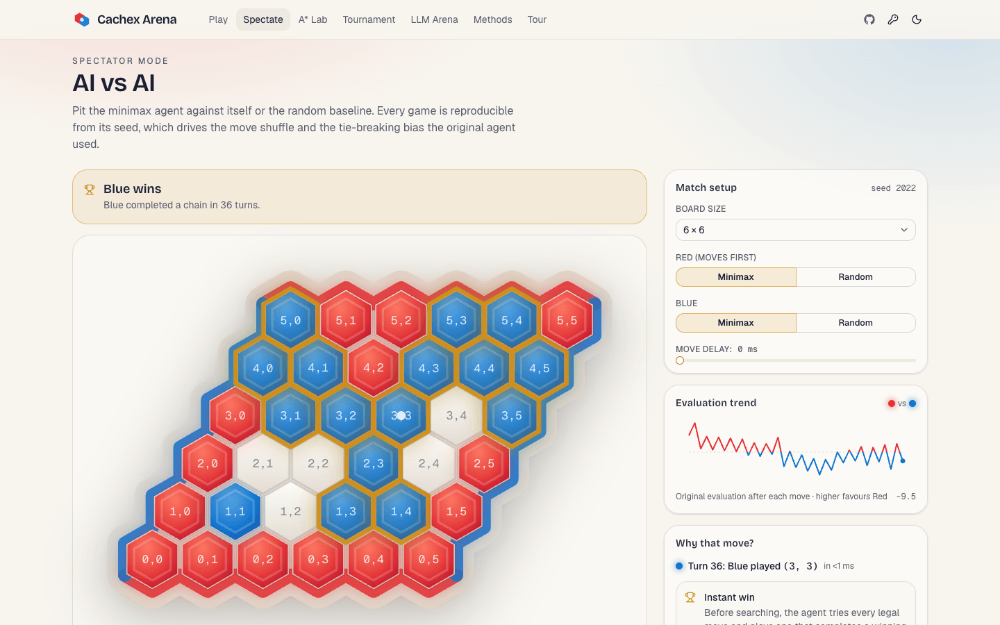<br>**AI vs AI.** A seeded agent-vs-agent game with the evaluation trend. |
| 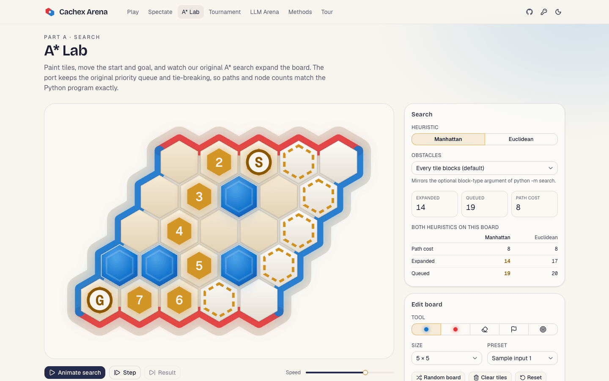<br>**A\* Lab.** The original sample input: an 8-cell path that matches the recorded output. | 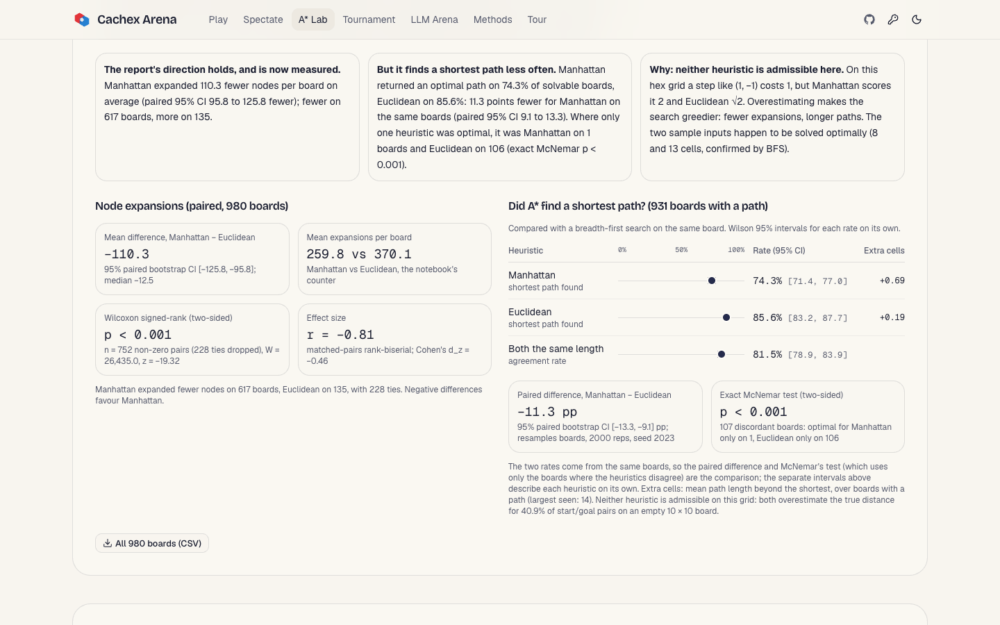<br>**Paired heuristic study.** 980 paired boards: bootstrap CI, Wilcoxon test, BFS optimality and McNemar. |
| 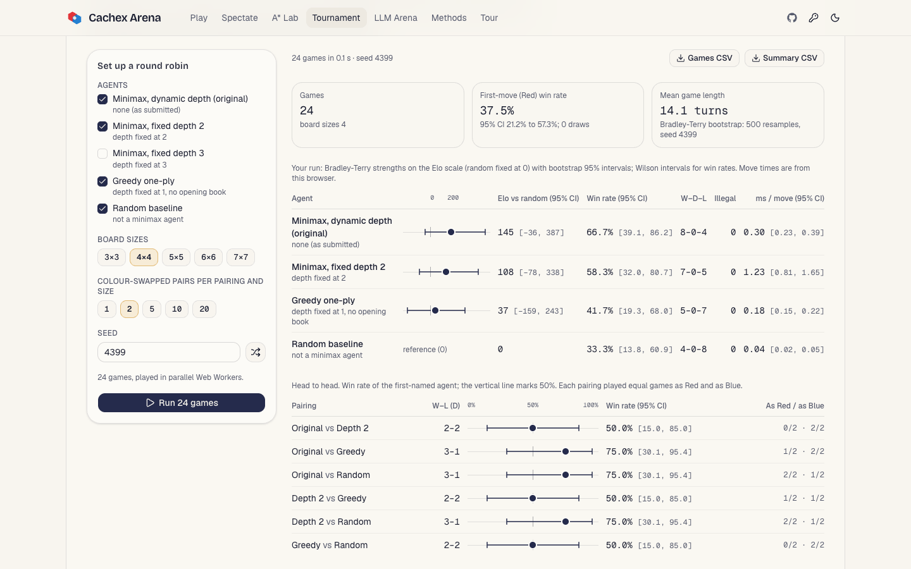<br>**Tournament harness.** A seeded 24-game round robin: Wilson and bootstrap 95% intervals. | 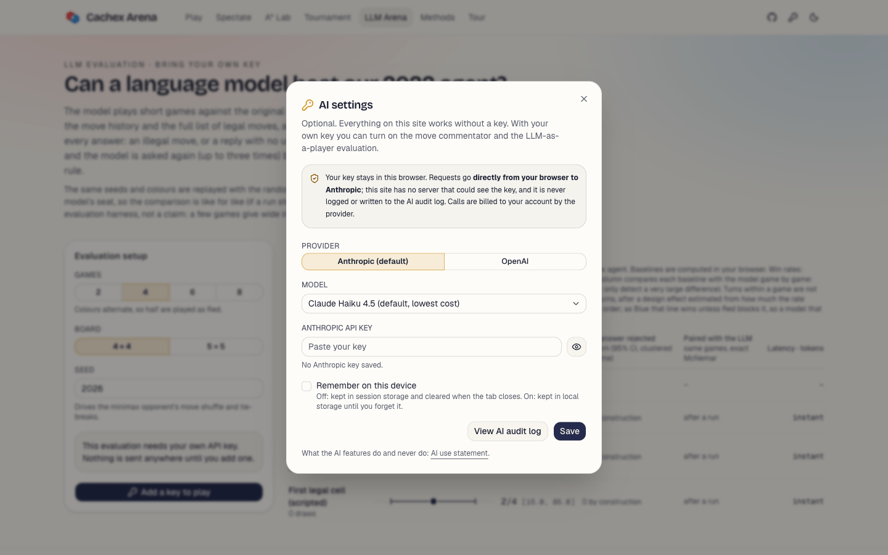<br>**Bring your own key.** AI settings: Anthropic by default, the key stays in this browser. |
| 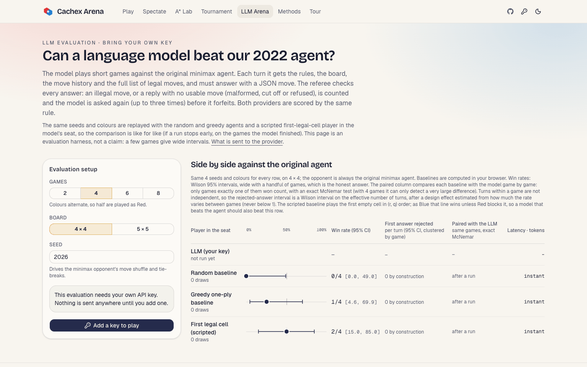<br>**LLM Arena.** The LLM-as-a-player harness and its baselines on the same seeds (no key needed). | 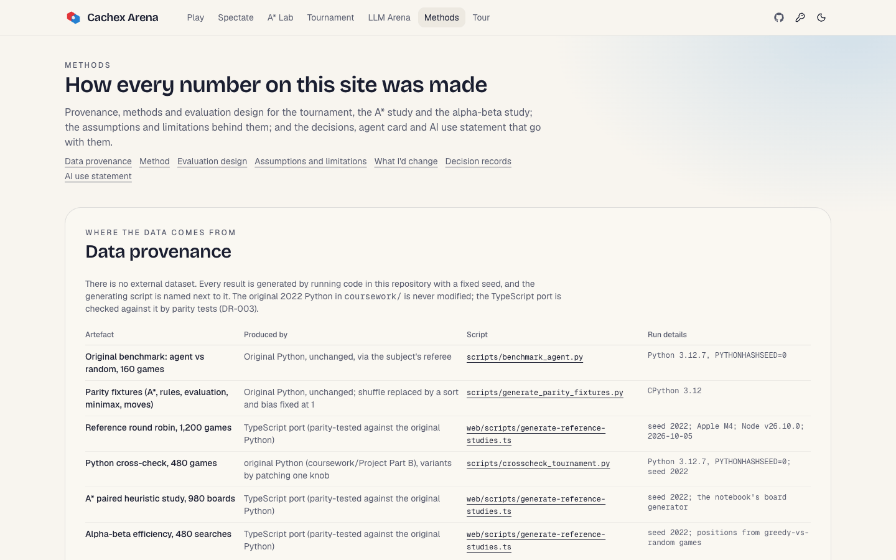<br>**Methods.** Provenance, evaluation design, limitations, decision records and AI use. |
| 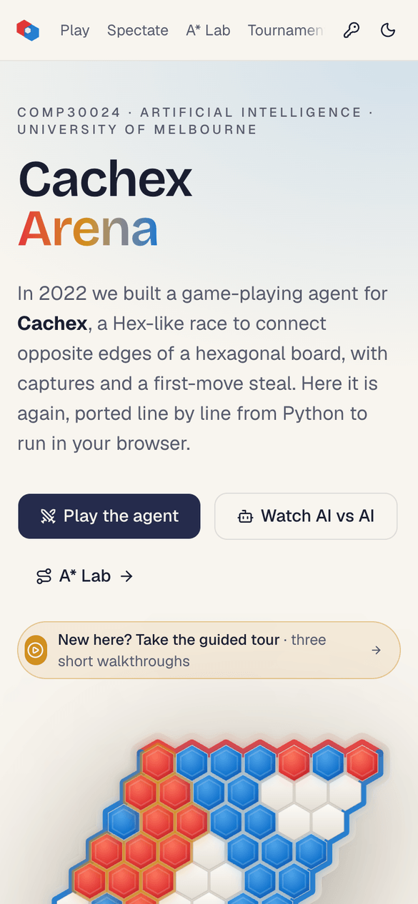<br>**Mobile: landing.** The landing page at 390 px. | 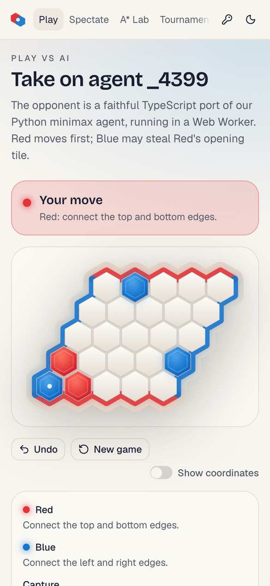<br>**Mobile: play.** Playing the agent on a phone, after the recapture. |
| 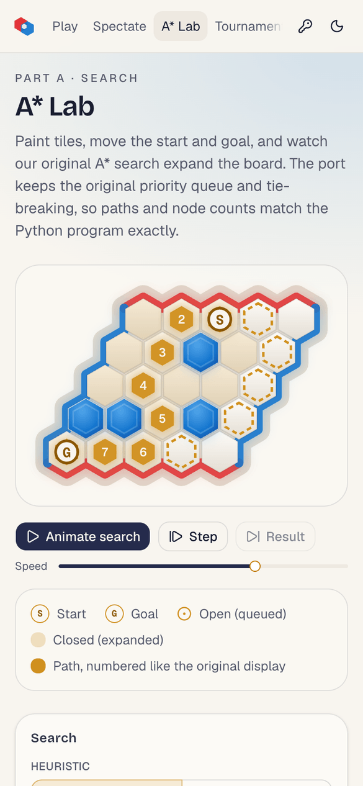<br>**Mobile: A\* Lab.** The A\* Lab with the sample input's path. | **[More on /tour →](https://cachex-ai.vercel.app/tour)** Every screenshot in a lightbox, and the three videos with captions and transcripts. |

### Workflow walkthrough

The numbered steps are the captions shown on screen. The videos on
[/tour](https://cachex-ai.vercel.app/tour) play in real time with captions; the GIFs here are
shortened (waits on the app and scrolls are cut, and they play at 1.25× speed).

#### 1. Play the agent (`/play`)

Setup: 5 × 5, you play Red against the minimax agent, page seed 4399. (The GIF at the top of this section.)

1. Open Play: a 5 × 5 board against the minimax agent (seed 4399), coordinates on
2. Red opens on the strong cell (1, 1)
3. Blue steals: Red's opening tile is mirrored across the diagonal and becomes Blue's
4. Red plays (0, 1); the agent answers at (4, 1)
5. Red plays (1, 0), leaving two red tiles inside a diamond
6. Capture: Blue closes the diamond at (0, 0) and removes both red tiles
7. Red retakes (0, 1); the agent plays (1, 4)
8. Recapture: Red plays (1, 0) and removes Blue's (0, 0) and (1, 1)
9. Why that move? Pick the capture in the move log: search depth, candidate scores, features

#### 2. A\* Lab (`/astar`)

Setup: preset “Sample input 1” (`code/sample_input.json`); reference study seed 2022.

1. Open the A* Lab: the Part A search, ported line by line from Python
2. Load the original sample input (code/sample_input.json)
3. Manhattan, as in the recorded output: animate the expansions
4. An 8-cell path that matches sample_output.txt from the original repo
5. Switch to Euclidean and animate the same board
6. Same board, both heuristics: path cost, nodes expanded, queue pushes
7. Paired study on 980 boards: paired bootstrap CI and Wilcoxon test on expansions
8. Optimality against breadth-first search: paired difference and exact McNemar test

<details>
<summary>Watch the A* Lab walkthrough (GIF, 6.7 MB)</summary>
<p align="center">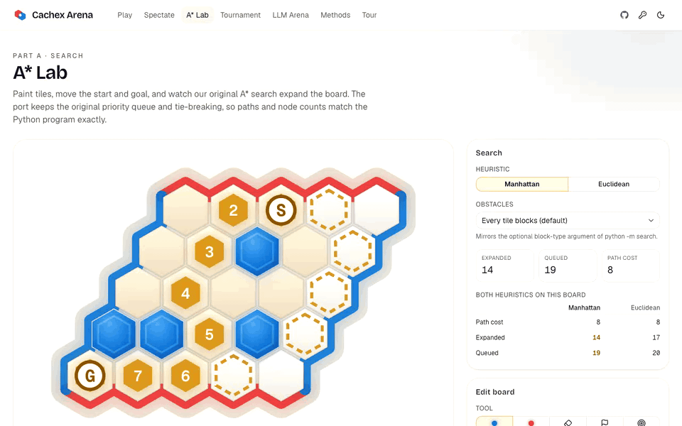</p>
</details>

#### 3. Tournament and LLM evaluation (`/tournament`, `/llm-arena`, `/ai-log`)

Setup: round robin of 4 agents on 4 × 4, 2 colour-swapped pairs, seed 4399; LLM Arena 2 games on
4 × 4, seed 2026. Steps 6 to 10 are a **mocked AI response for illustration**: the key is a
placeholder, every request to the provider is intercepted in the browser and answered by a mock
that plays the first legal cell, so the LLM row shows the mock, not a real model's results.

1. Open the tournament harness: a seeded, colour-swapped round robin
2. Keep 4 agents and seed 4399; 4 × 4 only, 2 colour-swapped pairs: 24 games
3. Run all 24 games in parallel Web Workers
4. Win rates with Wilson 95% CIs, Bradley-Terry strengths with bootstrap CIs
5. AI settings: bring your own key, kept in this browser and sent only to the provider
6. For this demo: a placeholder key and the model id “mock-for-illustration”, no real key
7. LLM Arena: 2 games on 4 × 4 against the minimax agent, on the baselines' seeds
8. Every reply is checked against the legal moves and labelled AI-generated
9. Side by side with random, greedy and scripted baselines, Wilson 95% CIs
10. Every call is in the AI audit log, with JSON and CSV export
11. Forget key: the placeholder is removed from this browser

<details>
<summary>Watch the tournament and LLM evaluation walkthrough (GIF, 7.4 MB)</summary>
<p align="center">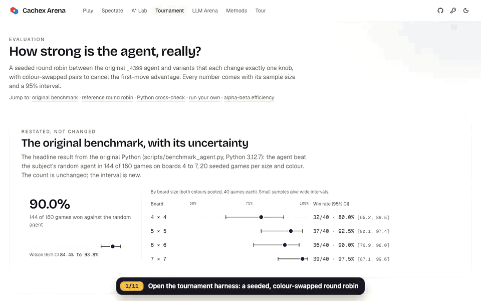</p>
</details>

## Overview

Cachex is a two-player connection game on an _n_ × _n_ rhombic hex board, based on Hex.
Red links the top and bottom edges, Blue links the left and right. Two twists make it
tactical: placing a tile that closes a **diamond** around two enemy tiles captures them, and
Blue may **steal** Red's opening tile on its first move.

In Semester 1, 2022, team `_4399` (Sunchuangyu "Rin" Huang and Wei Zhao) built two things for
COMP30024 Artificial Intelligence at the University of Melbourne:

- **Part A: search.** An A\* solver that finds the shortest chain of free cells between two
  points, with Manhattan and Euclidean (Minkowski) heuristics and a notebook study comparing
  their node expansions on random boards.
- **Part B: a game-playing agent.** Minimax with alpha-beta pruning, a dynamically allocated
  search depth, a hand-tuned six-feature evaluation function (`weights.json`), an opening book
  and an instant-win check, run against the subject's referee.

This repository revives that work as **Cachex Arena**, a static Next.js app. The Python was
ported to TypeScript line by line and is verified against the original code.

### Features

| Route | What you can do |
| --- | --- |
| `/` | What the coursework asked, what we built, key results from the original code (now with their confidence intervals), credits |
| `/play` | Play the minimax agent (or the random baseline) on 3×3 to 10×10, as Red or Blue, with STEAL, capture animations, undo, a move log and a "why that move?" panel (search depth, top candidates, evaluation feature breakdown), plus an optional AI commentary on the move |
| `/spectate` | AI vs AI with play/pause/step, a speed control, seeded replays, an evaluation trend chart and the same optional commentary |
| `/astar` | Paint tiles, move start and goal, animate A\* expansions, toggle Manhattan/Euclidean and the original block-colour option, load or export the original `sample_input.json` format, and a **paired heuristic study**: both heuristics on the same random boards, paired bootstrap interval, Wilcoxon signed-rank test, effect sizes, and an optimality check against breadth-first search |
| `/tournament` | **Round-robin harness**: the original agent vs fixed-depth, greedy and random variants, colour-swapped and seeded, in parallel Web Workers. Wilson intervals for win rates, Bradley-Terry strengths on the Elo scale with bootstrap intervals, first-move effect, move times, CSV export. Shows a precomputed 1,200-game reference tournament, a cross-check against the original Python, the original 144/160 benchmark restated with its interval, and an **alpha-beta efficiency study** |
| `/llm-arena` | **LLM as a player** (bring your own key): a language model plays short games against the minimax agent via structured JSON moves validated against the legal moves; win rate with Wilson interval, the share of turns whose first answer was rejected (illegal move vs no usable move, scored the same way for both providers; interval from a bootstrap over games), forfeits, latency and tokens, side by side with random, greedy and a scripted first-legal-cell baseline on the same seeds (only the games the model finished, if a run stops early), each compared with the model game by game (exact McNemar) |
| `/methods` | Data provenance, method, evaluation design, assumptions, limitations, "what I'd change", the decision records (`/methods/decisions/…`), the agent card (`/methods/agent-card`) and the AI use statement |
| `/ai-log` | The AI audit log: every AI call made from this browser, with exact input, output, latency, tokens and your review decision; JSON and CSV export |
| `/tour` | The guided tour: three captioned walkthrough videos (play the agent, the A\* Lab, the tournament and LLM evaluation) with step lists and transcripts, and every screenshot in a lightbox |

Agents, the heuristic study and the tournament run in **Web Workers**, so the board stays responsive. Everything works without an API key; the AI features are optional.

### Key results

From the original Python:

- The `_4399` agent beat the original random agent in **144 of 160 games**: 90.0%, Wilson 95% CI
  84.4% to 93.8% (boards 4 to 7, both colours, `scripts/benchmark_agent.py`).
- A\* reproduces the recorded outputs for both sample inputs (paths of **8** and **13** cells, both
  confirmed shortest by breadth-first search).
- The TypeScript port matches the original **exactly**: paths and node-expansion counts for 184 A\*
  runs, every board state and capture across 40 random refereed games, evaluation features on
  237 positions, 179 minimax searches, 143 agent moves and 5 full self-play games.

From the 2026 evaluation (details, seeds and downloadable data on the site):

- **Dynamic depth barely runs.** In a 1,200-game round robin (4×4 to 6×6), the original searched
  deeper than one ply on 34 of 4,602 searched moves (0.7%), and there is no detectable difference
  from a greedy one-ply agent on the same evaluation (61 wins to 59; 50.8%, 95% CI 42.0% to
  59.6%; Elo difference +15, 95% CI −24 to +56). That interval only rules out differences larger
  than about 10 points of win rate. Fixed depth 3 beats it in 84 of 120 games and is 151 Elo
  stronger (95% CI 106 to 195; Elo differences come from the same bootstrap refits, not from
  comparing two intervals).
- **It does not block one-move wins.** Searching one ply, it never looks at the opponent's next
  move: a scripted Blue that just fills row 0 left to right beats it in 50 of 50 seeded games on
  4×4 (43 of 50 on 5×5, 34 of 50 on 6×6). The LLM arena uses this script as a baseline.
- **Alpha-beta saves almost nothing because of a one-line bug.** The original's
  `if beta <= min_score: beta = min_score` never narrows the window: beta stays at +infinity, so
  a cut-off can only happen once the search finds a line it scores as a forced win for Red. 444 of
  480 test searches visited every node of the full minimax tree, and the 36 that pruned anything
  visited between 0.6% and 92% of it; averaged per board size, depth and move order that is 92% to
  100%, against 17% to 45% for a textbook update. Results are unaffected (all 480 searches return
  the same value as plain minimax). The site keeps the agent as submitted (DR-002, DR-005).
- **Manhattan is faster but less often optimal.** On 980 paired random boards Manhattan expands
  110 fewer nodes per board (95% CI 96 to 126 fewer; Wilcoxon p < 0.001, rank-biserial r = −0.81)
  but returns a shortest path on 74.3% of solvable boards (71.4% to 77.0%) against 85.6% (83.2% to
  87.7%) for Euclidean. On the same 931 boards that is 11.3 points fewer (paired bootstrap 95% CI
  9.1 to 13.3); where only one heuristic was optimal it was Manhattan on 1 board and Euclidean on
  106 (exact McNemar p < 0.001). Neither heuristic is admissible on this hex grid.
- **No detectable disagreement with the original Python** on the pairings feasible in Python
  (480 games; every Newcombe 95% interval for the six win-rate differences contains 0). With 80
  games per pairing this check can only detect differences larger than about ±15 points.

## Bring your own key (optional AI features)

The two AI features (the move commentator and LLM-as-a-player) only run if you paste **your own**
API key into **AI settings** (the key icon in the header):

- **Providers:** Anthropic (default; Claude Haiku 4.5, or Claude Sonnet 5.5) or OpenAI (any model id
  you type, default `gpt-5-mini`).
- **Where the key lives:** in your browser only. Session storage by default (cleared when the tab
  closes); local storage only if you tick "remember on this device". "Forget key" removes every
  saved key, for both providers.
- **Where it goes:** calls go **directly from your browser** to the provider (Anthropic with the
  `anthropic-dangerous-direct-browser-access` header via the official SDK; OpenAI's Chat
  Completions API). This is a static site with no server, so the key is never sent to us, never
  logged and never committed.
- **Grounding and review:** the commentator receives only the agent's own numbers for the move,
  including what the score means at that search depth (a deeper search or a forced win is not
  explained by the one-ply feature breakdown). An automatic check verifies feature directions,
  numbers, moves, which player moved and that a forced win is reported as the search found it;
  you then accept, edit or reject the commentary. Every model output is labelled "AI-generated".
- **Audit log:** every call (success or failure) is recorded in IndexedDB with timestamp, feature,
  provider, model, exact input, output, latency, token usage, the grounding check result and the
  human decision, so an export shows when a reviewer accepted commentary that failed its check.
  View it at **`/ai-log`** and export it as JSON or CSV. Keys are never written to it.

The AI use statement on `/methods` (source: [`docs/ai-use-statement.md`](docs/ai-use-statement.md))
explains what the features do and never do. It is informed by the Australian DTA policy for the
responsible use of AI in government, EU AI Act transparency principles and the NIST AI RMF; it is
not a claim of compliance with any of them.

## Methods and decision records

- [`docs/model-card.md`](docs/model-card.md): the agent card (intended use, provenance, evaluation
  with intervals, known weaknesses).
- [`docs/decisions/`](docs/decisions): decision records, each stating the decision first, then
  context, options, reasons, what happened (weak numbers included) and what I'd change.
  - [DR-001](docs/decisions/DR-001-evaluation-function.md) evaluation function features and weights
  - [DR-002](docs/decisions/DR-002-dynamic-depth-allocation.md) dynamic depth allocation
  - [DR-003](docs/decisions/DR-003-typescript-port-web-workers.md) TypeScript port, Web Workers and parity testing
  - [DR-004](docs/decisions/DR-004-paired-comparisons.md) comparing two methods by their paired difference
  - [DR-005](docs/decisions/DR-005-report-at-the-sampled-unit.md) reporting uncertainty at the unit that was sampled (supersedes DR-002's pruning-ratio sentence)
  - [DR-006](docs/decisions/DR-006-grounded-commentary-audit.md) grounding commentary in what the search found, and storing the check with the human decision
- All of these are rendered on the site under `/methods`. Past records are never edited; a new
  record supersedes an old one.

## Tech stack

| | 2022 original | 2026 revival |
| --- | --- | --- |
| Language | Python 3.6 | TypeScript (strict) |
| Libraries | NumPy, SciPy, Jupyter | Next.js 16 (App Router), React 19, Tailwind CSS v4, shadcn/ui (Radix), lucide-react, next-themes, zod, Anthropic TypeScript SDK (browser, BYOK), react-markdown |
| Compute | CLI / referee | Web Workers, fully client-side; no backend |
| Testing | Notebook experiments | Vitest parity tests against fixtures generated by the original code; statistics verified against scipy, statsmodels and R; AI clients tested with mocked fetch |
| Tooling | conda | pnpm, ESLint, Prettier, GitHub Actions, uv for the Python scripts |

## Repository structure

```
Cachex-AI/
├── coursework/                 # original submission, unchanged (see coursework/README.md)
├── docs/                       # agent card, AI use statement, decision records (rendered on /methods)
│   └── showcase/               #   README screenshots and GIFs (pnpm showcase)
├── scripts/                    # uv scripts that run the ORIGINAL Python
│   ├── generate_parity_fixtures.py
│   ├── benchmark_agent.py      #   144/160 vs random
│   └── crosscheck_tournament.py#   tournament pairings feasible in Python
├── web/                        # the deployable Next.js app (Vercel root)
│   ├── e2e/                    # Playwright guided tour: journeys as end-to-end tests, records the showcase
│   ├── content/docs/           # synced copy of docs/ (pnpm sync-docs; a test checks they match)
│   ├── public/showcase/        # /tour videos (MP4), captions (WebVTT), posters, screenshot copies
│   ├── scripts/                # generate-reference-studies.ts (tsx), sync-docs.mjs, showcase*.mjs
│   └── src/
│       ├── app/                # / , /play, /spectate, /astar, /tournament, /llm-arena, /methods, /ai-log, /tour, CSV routes
│       ├── components/         # ui/, layout/, board/, play/, astar/, tournament/, stats/, ai/, methods/, tour/
│       ├── hooks/              # match state, Web Worker clients and the tournament worker pool
│       ├── lib/
│       │   ├── cachex/         #   referee rules: board, captures, STEAL, win/draw
│       │   ├── agent/          #   Board_4399, evaluation features, minimax, opening book, random agent
│       │   ├── astar/          #   A*, CPython set-order simulation, input format, presets, study
│       │   ├── stats/          #   Wilson, Newcombe, bootstrap, Wilcoxon, Bradley-Terry (+ tests)
│       │   ├── tournament/     #   agents and variants, schedule, game runner, analysis, Python cross-check
│       │   ├── analysis/       #   paired A* study, alpha-beta efficiency
│       │   ├── ai/             #   BYOK provider adapters, audit log, commentator, LLM player (+ tests)
│       │   ├── data/           #   generated study data (JSON) and their configs
│       │   └── __fixtures__/   #   parity fixtures (generated)
│       └── workers/            # agent, A* study and tournament workers
├── .github/workflows/ci.yml
└── LICENSE
```

## Local development

Requires Node.js 20+ and pnpm 10.

```bash
cd web
pnpm install
pnpm dev            # http://localhost:3000

pnpm lint           # ESLint
pnpm typecheck      # tsc --noEmit
pnpm test           # Vitest (parity, statistics, tournament and AI-client tests)
pnpm build && pnpm start

pnpm gen:reference  # regenerate the reference studies (TypeScript port, a few minutes)
pnpm sync-docs      # copy ../docs into web/content/docs after editing the docs
```

### Guided tour and showcase media

`pnpm showcase` runs the guided tour in [`web/e2e/showcase.spec.ts`](web/e2e/showcase.spec.ts) with
Playwright on the system Google Chrome (no browser is downloaded; the ffmpeg on `PATH` records the
video). Each journey is an end-to-end test that asserts what it shows (the steal, both captures,
the recorded A\* output, the seeded tournament, the mocked LLM run and the audit log), then
[`web/scripts/showcase-media.mjs`](web/scripts/showcase-media.mjs) writes the screenshots and GIFs
in `docs/showcase/` and the MP4s, captions and posters in `web/public/showcase/`.

```bash
pnpm showcase                                  # against production (BASE_URL defaults to it)
BASE_URL=http://localhost:3000 pnpm showcase   # after pnpm build; the server is started for you
pnpm showcase:test                             # quick end-to-end check: no pauses, no video
```

## How the data artefacts are generated

The Python scripts import the **original, unchanged** Python from `coursework/` and are run with
[uv](https://docs.astral.sh/uv/) (dependencies are declared inline, PEP 723):

```bash
uv run scripts/generate_parity_fixtures.py   # → web/src/lib/__fixtures__/parity-part-{a,b}.json
uv run scripts/benchmark_agent.py            # → web/src/lib/data/agent-benchmark.json
uv run scripts/crosscheck_tournament.py      # → web/src/lib/data/python-crosscheck.json
cd web && pnpm gen:reference                 # → web/src/lib/data/{reference-tournament,astar-paired-study,alpha-beta-study}.json
```

- **Parity fixtures** record the original outputs for the sample inputs, the notebook test
  boards and seeded random boards (A\*), plus seeded random referee games, evaluation features,
  minimax results, `Player.action` choices and deterministic self-play (Part B). For Part B the
  script replaces `random.shuffle` with a canonical sort and the evaluation's random bias with 1,
  so results are deterministic; nothing else is patched.
- **Neighbour order.** The original A\* iterates neighbours out of a Python `set`, so ties are
  broken by CPython's hash-table order. `web/src/lib/astar/python-set-order.ts` simulates
  CPython 3.8+ tuple hashing and set probing so the port returns the same paths and node counts.
  Fixtures are generated with CPython 3.12.
- **Benchmark.** `_4399` vs `random_play_agent`, 20 seeded games per board size and colour.
  The original `get_valid_actions` returns a `set` of `("PLACE", r, q)` tuples, and CPython
  randomises string hashes per process, so the script re-runs itself with `PYTHONHASHSEED=0`;
  with that pin the output is byte-for-byte reproducible.
- **Reference studies** (`web/scripts/generate-reference-studies.ts`, configs in
  `web/src/lib/data/reference-config.ts`) use the parity-tested TypeScript port, because depth-3
  search in the original Python is far too slow at this scale. Seeds are fixed (2022), so results
  are reproducible apart from wall-clock move times.
- **Cross-check.** `scripts/crosscheck_tournament.py` rebuilds the tournament variants from the
  unchanged Python (patching only `dynamic_depth_allocation` and the opening-book flag) and
  replays the feasible pairings, so the TypeScript harness can be compared with the original.

### Verifying the statistics

The helpers in `web/src/lib/stats` are tested against reference values computed with
scipy 1.17 and statsmodels (`uv run --with scipy --with statsmodels`) and cross-checked in R
(`prop.test(correct = FALSE)`, `wilcox.test`, `quantile(type = 7)`): Wilson and Newcombe
intervals, exact and normal-approximation Wilcoxon p-values with ties and zeros, type-7 quantiles,
and Bradley-Terry maximum-likelihood strengths. The reference values are listed in
`web/src/lib/stats/stats.test.ts`.

## Credits

- **Sunchuangyu "Rin" Huang** ([@rNLKJA](https://github.com/rNLKJA)) and **Wei Zhao**, team `_4399`.
- The referee (`coursework/Project Part B/code/referee`) and project specifications were provided
  by the COMP30024 teaching team at the University of Melbourne. The website paraphrases the task
  and does not host the specification PDFs.

## Academic integrity

The original submission is preserved in [`coursework/`](coursework) for reference. If you are
a current COMP30024 student, please respect academic integrity and do not copy this work.

## Licence

[MIT](LICENSE) © 2022 Sunchuangyu Huang & Wei Zhao.
